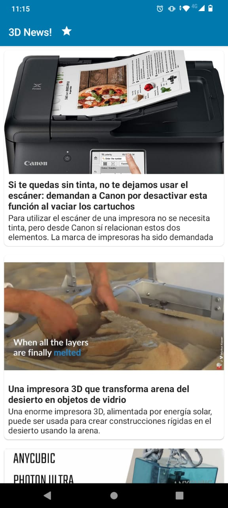
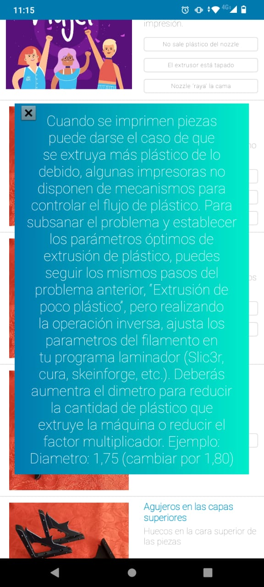

# idea3D
Idea 3D pretende ser una caja de herramientas para "makers" y tiene cómo finalidad ser un espacio para la emergente comunidad de impresión 3D en 2atinoamérica.
.jpeg)
.jpeg)

.jpeg)
.jpeg)

.jpeg)
